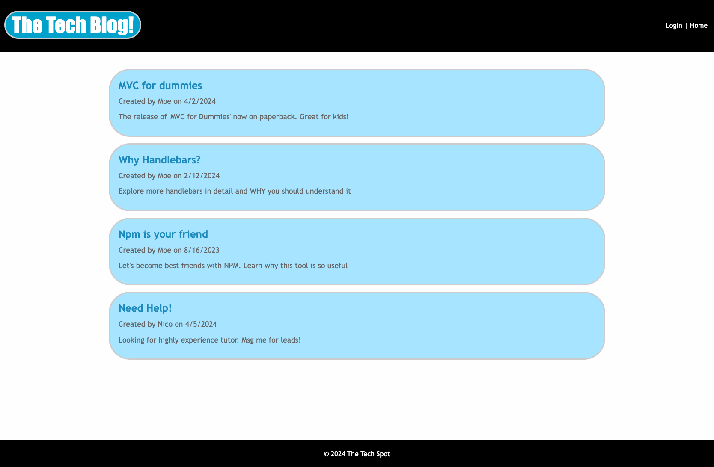

# tech-blog

## Description

  The Tech Blog application was built to represent how the MVC structure is used to dynamically change pages with it's 
  content based off user action in a blog style setting. Functionalities such as account authentication, content posting with comment capabilities, and linting are present for solid references that can be utilized later.

## Table of Contents

- [Installation](#installation)
- [Usage](#usage)
- [Technologies](#technologies)
- [Contributing](#contributing)
- [Demo](#demo)
- [Questions](#questions)

## Installation

1. Clone the repository `git clone git@github.com:NPetkas/tech-blog.git`.
2. Navigate to the project directory in terminal.
3. Install dependencies `npm i`.
4. Run `mysql -u root -p` to start MYSQL.
5. inside mysql, source schema`SOURCE db/schema.sql`.
6. `Exit` mysql.

## Usage

1. Run `npm run seed` to seed database with 'data'.
2. Start app in terminal by running `npm run watch`.
3. Navigate to URL `http://localhost:3001` application.
4. Create an account.
5. Publish a blog post.
6. Comment on an existing post.
7. Continue with each action as desired.
8. When finished, navigate to terminal, and exit server by typing `control(^) + 'c'`.

## Technologies

- DotEnv
- MYSQL
- Express
- Sequelize
- Handlebars
- Cookies

## Contributing

To contribute:

1. Create a new branch
2. Make your changes
3. Submit a pull request

## Demo

[Link to App][def1]

[def1]: https://young-dusk-89839-466a71e017a2.herokuapp.com/

## Questions

Contact information for any questions:

Github Profile: [https://github.com/NPetkas](https://github.com/NPetkas)

Link to Repo: [https://github.com/NPetkas/tech-blog](https://github.com/NPetkas/tech-blog)

Email: [nicopetkas@gmail.com](nicopetkas@gmail.com)